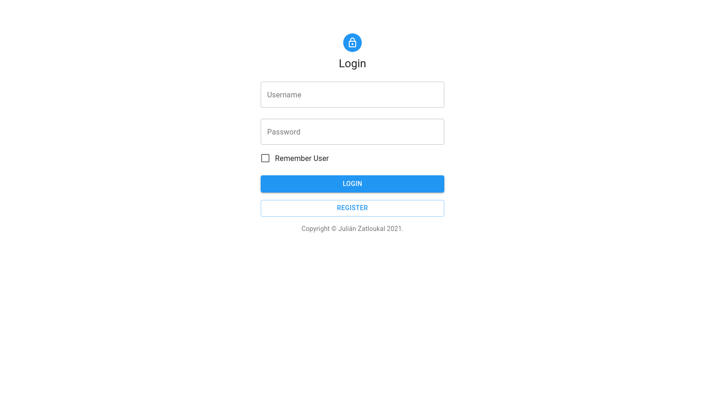
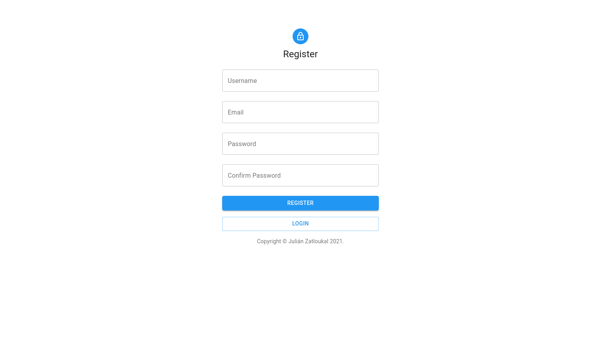
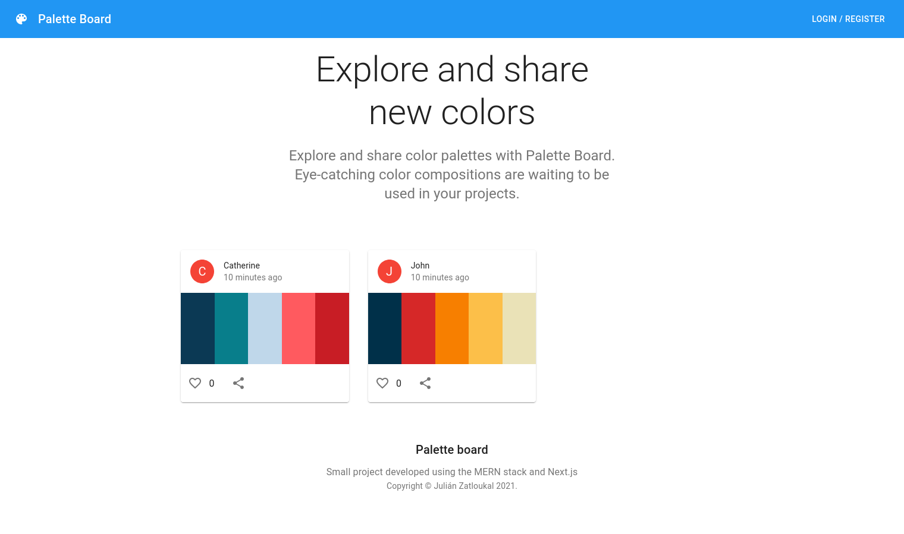
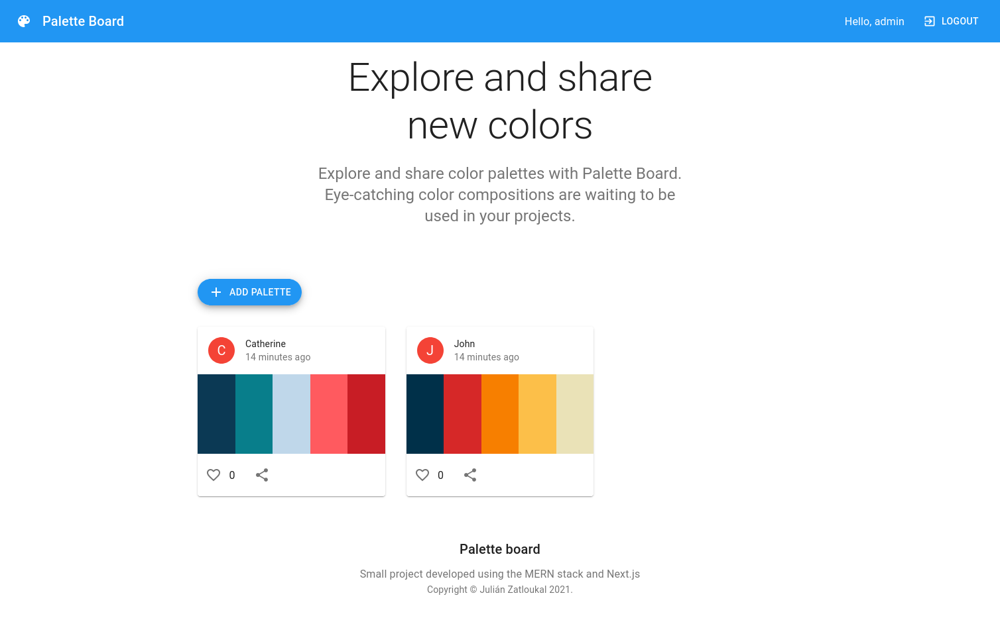
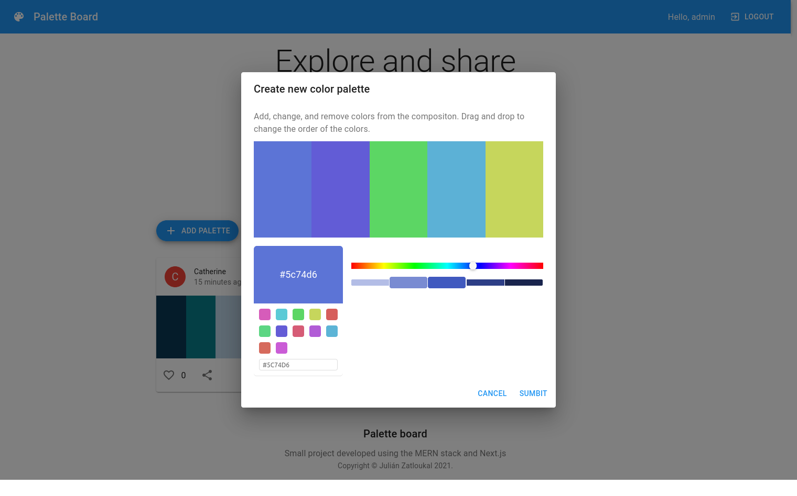
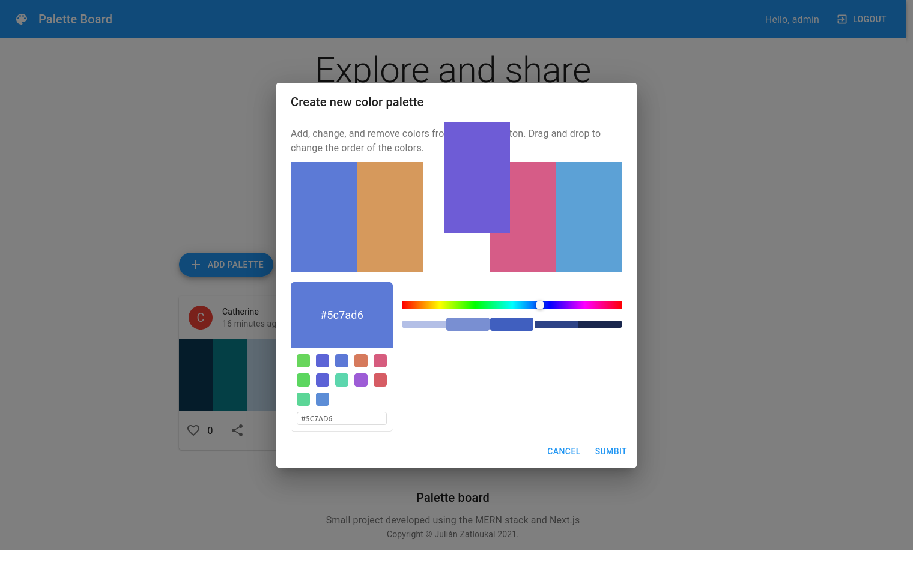
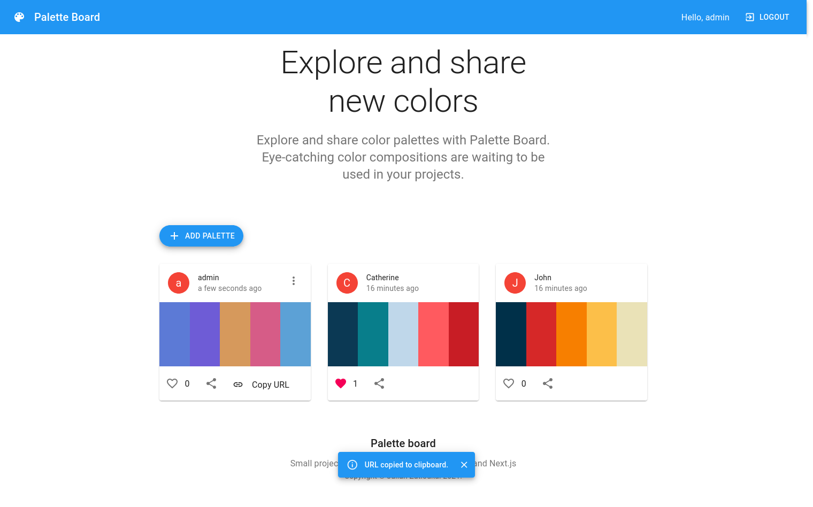
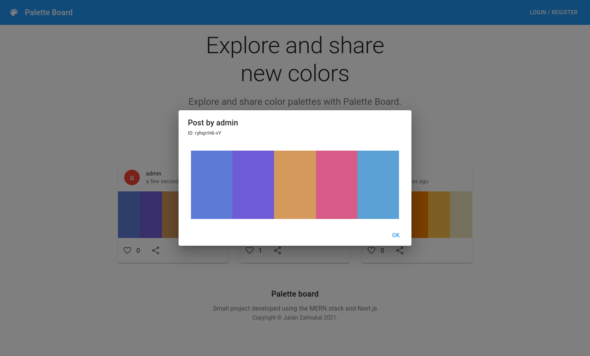

# Color Palette Board
Small showcase project developed using the MERN stack and Next.js. The main objective of the project is to demonstrate the usage of various technologies such as Next.js, MongoDB, Express.js, and Docker.

The project is about a website that allows registered users to post, like, and share color palettes. A color palette is a combination of colors that is commonly used in the software industry to design user interfaces and ensure a consistent color scheme.

## Technologies used
 - Project and development
   - Docker with docker-compose for project containerization
   - Google Cloud Platform to test project deployment
   - Version control with Git alongside Github hosting
   - Trello and Clockify to track project progress
 - Website, frontend
   - Next.js (server-side rendering)
   - React
   - Material UI
   - Redux (toolkit)
   - react-beautiful-dnd
   - react-color
 - API, backend
   - Node.js
   - Express.js
   - MongoDB with mongoose ODM
   - jsonwebtoken (JWT)

## Instalation
### Requirements
The requirements for installing and running the project are docker, docker-compose, and nodejs with npm.
### Clone repository and configure permissions
```
git clone https://github.com/julian-zatloukal/color-palette-board.git
chmod 775 -R color-palette-board/
```
### Install dependencies
```
cd api/
npm ci
cd ../website/
npm ci
npm run build
cd ..
```
### Build and run containers
```
cd api/
docker-compose up --build
```

## Screenshots








